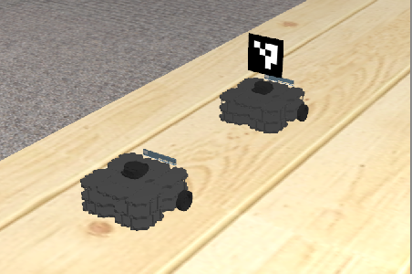
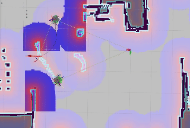
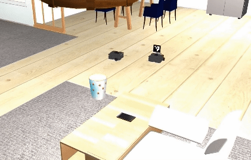
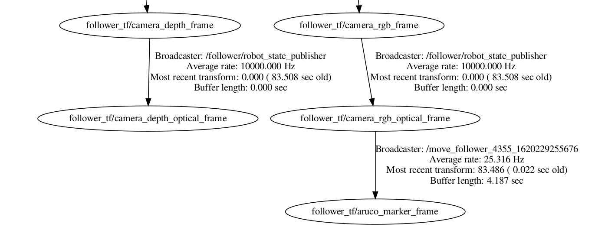
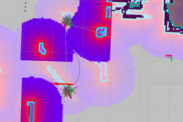
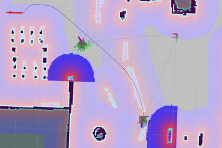

# Visual-Servoing

[](https://travis-ci.com/github/savnani5/Obstacle-Avoidance-System)
[](https://coveralls.io/github/savnani5/Obstacle-Avoidance-System?branch=main)
[](https://opensource.org/licenses/BSD-3-Clause)

## Overview
The essence of the project is to utilize a technique known as Visual Servoing to control the motion of a robot. Visual Servoing is a method of controlling a robot’s motion using real-time feedback from vision sensors to execute tasks like tracking objects and following objects.

For this project, we drive two turtlebots in a house environment(simulated in Gazebo) to move between predetermined way-points. Among these two bots, one drives around using mapping and localization where as the other has to utilize visual servoing to follow the first one. The one that uses mapping and localization is named as leader and the other one is follower. In order to utilize the capabilities of visual servoing technique in gazebo environment, the leader has been provided with an Aruco Marker, which will be perceived by the follower’s camera to follow the leader and also enables the follower to keep a safe distance between the two of them. For detailed report checkout [this link](https://github.com/savnani5/Visual-Servoing/blob/main/Python_Applications_for_Robotics.pdf).








---
## Pipeline

### Location Recorder
In this step we map the environment and record the robot locations into a yaml file using a ROS service. **aws-robomaker-small-house-world** consists of the gazebo world used for this project.


### Leader Motion
The leader robot is fed with predetermined way points in the environment and it performs au-
tonomous navigation to move from one preset location to the other. So, as for any autonomous
navigation, it first requires a map and in this case has been generated using the slam gmapping
node from the gmapping package. Next step was to access this map which was done using the
map server node from map server package. Later on to perform the required path planning
to successfully move from one point to the other within a map the leader uses the move base
node from the move base package. Finally, to continuously localize the robot in the map it uti-
lizes uses the amcl node from the amcl package and the benefit of this is package is the more
the robot moves in the environment, the more data the robot will get from sensor readings,
which results in more accurate localization. This approach ensures that the robot is capable of
performing navigation while avoiding the obstacles in the environment.

### Pose Broadcaster
This node is responsible for initializing a subscriber to recieve fiducial transforms from the
aruco marker detection. The transformation between the map and the marker is not directly
obtained by can be found by determining the following three transformations: map-robot,
robot-camera, camera-marker. The fiducial transforms contain the pose of the marker
with respect to the follower camera frame. We create a tf broadcaster to transmit these trans-
forms to the tf tree an finally we perform a lookup transform to get the pose of the marker
with respect to the map frame.

    

### Follower Motion
The follower’s task is to detect the marker placed on top of the leader and use the move base
action client to move to the marker’s location. In order to achieve this we would need the lo-
cation of the marker in global co-ordinates which can be obtained by the transformation be-
tween the map and the marker using the pose broadcaster node and lookup transformation.
So, by keeping a track of these transformations we continuously obtain the marker’s location
and drive the follower. move base client is a recursive function which calls itself continuously
till the marker is in the sight and waits for the server to execute the maneuvers. It stores the transforms into a buffer variable to enable the traversal to the latest point the marker was detected and it continuously updates this variable. If the marker is lost from the camera sight of the follower camera, the lookup transforms through an error and the search protocol is executed in the except block. Following the protocol, the follower first rotates for 360 degrees and if it finds the marker it follows it, else it reads the parameter server value, set by the leader and tries to reach that location using move base
to increase the probability of detection. If it reaches the position and still doesn’t find the marker, it rotates continuously at that position.
The challenging part in this section is to make the follower continuously follow the marker
without loosing its sight and to take into account the rotations and the translations of the
leader to calculate relative angular error rates and synchronize the speed.

     

---
## Dependencies
- Ubuntu 18.04 (Operating System)
- Python 3.6.9
- CMake (Build System)
- ROS Melodic
- Gazebo
- RVIZ

---
## ROS and Python Dependencies
- PyYAML 5.4.1 (Please install this version, because sort_keys is not supported in the previous versions.)
- numpy
- rospkg
- actionlib
- rospy
- geometry_msgs
- move_base_msgs
- fiducial_msgs


---
## Build Instructions
Follow the build instructions to build on your local system. 

- Make and initialize the catkin workspace.
  ```
  mkdir -p ~/catkin_ws/src
  catkin config --init
  ```

- Clone this repo and copy all the package folders to the src directory in catkin_ws. 
  ```
  git clone https://github.com/savnani5/Visual-Servoing.git
  cd ~/catkin_ws/src
  cp -R ~/Visual-Servoing/mapping ~/catkin_ws/src
  cp -R ~/Visual-Servoing/location_recorder ~/catkin_ws/src   
  cp -R ~/Visual-Servoing/aws-robomaker-small-house-world ~/catkin_ws/src
  cp -R ~/Visual-Servoing/final_project_group11 ~/catkin_ws/src
  cp -R ~/Visual-Servoing/gazebo_ros_link_attacher ~/catkin_ws/src
  ```

- Build the workspace and source the setup file.
  ```
  catkin build
  source ~/catkin_ws/devel/setup.bash
  ```

---
## Run Instructions

### Location Recording

- Run the below command to start the navigation process.
    ```
    roslaunch mapping start_navigation.launch 
    ```
- Run the below commandto start the service and start receiving requests to the server.
   ```
    rosrun location_recorder room_recorder
   ```
- Run the below commands to save the robot location in the *yaml* file.
    ```
    rosservice call room_service "livingroom"
    rosservice call room_service "recreationroom"
    rosservice call room_service "kitchen"
    rosservice call room_service "bedroom"
    ```
- Copy the yaml file to the yaml folder in the *final_project_group11* package.
 
---
### Visual Servoing

- Run the below command to start the gazebo world with both the robots.
  
  ```
  roslaunch final_project_group11 multiple_robots.launch
  ```
- Run the below command to attach the marker to the leader robot.

  ```
  rosrun final_project_group11 spawn_marker_on_robot
  ```

- Run the below command to start the navigation process and launch rviz.

  ```
  roslaunch final_project_group11 navigation.launch
  ```

- Run the below command to start broadcasting the *follower_tf/aruco_marker_frame* to the tf tree.

  ```
  rosrun final_project_group11 pose_broadcaster
  ```
- Run the below command to make the follower move.

  ```
  rosrun final_project_group11 move_follower
  ```

- Run the below command to make the leader move.

  ```
  rosrun final_project_group11 move_leader
  ```

**NOTE**: Do not take too much time between running the move_follower node and move_leader node. Also, you can run both move_follower and move_leader nodes simultaneously using ```roslaunch final_project_group11 run_script.launch```. But then the leader and follower outputs will come on a single terminal.


---
## Licence
    ```
    MIT License

    Copyright (c) 2021 Paras Savnani, Gautam Vanama, Santosh Kesani, Wenliang Zhen

    Permission is hereby granted, free of charge, to any person obtaining a copy
    of this software and associated documentation files (the "Software"), to deal
    in the Software without restriction, including without limitation the rights
    to use, copy, modify, merge, publish, distribute, sublicense, and/or sell
    copies of the Software, and to permit persons to whom the Software is
    furnished to do so, subject to the following conditions:

    The above copyright notice and this permission notice shall be included in all
    copies or substantial portions of the Software.

    THE SOFTWARE IS PROVIDED "AS IS", WITHOUT WARRANTY OF ANY KIND, EXPRESS OR
    IMPLIED, INCLUDING BUT NOT LIMITED TO THE WARRANTIES OF MERCHANTABILITY,
    FITNESS FOR A PARTICULAR PURPOSE AND NONINFRINGEMENT. IN NO EVENT SHALL THE
    AUTHORS OR COPYRIGHT HOLDERS BE LIABLE FOR ANY CLAIM, DAMAGES OR OTHER
    LIABILITY, WHETHER IN AN ACTION OF CONTRACT, TORT OR OTHERWISE, ARISING FROM,
    OUT OF OR IN CONNECTION WITH THE SOFTWARE OR THE USE OR OTHER DEALINGS IN THE
    SOFTWARE.

    ```

---
## Output

[Output Videos](https://drive.google.com/drive/folders/1e2rKtigzGvkU8Pw0axiI4ej4d714FebT?usp=sharing)

---
## References
• [Nick Lamprianidis (2020). Visual Servoing in Gazebo](https://nlamprian.me/blog/software/ros/2020/01/27/visual-servoing-in-gazebo/)

• [pal-robotics. aruco ros Github Repository](https://github.com/pal-robotics/aruco_ros/)

• [How to write a broadcaster using tf in ROS. ROS wiki](http://wiki.ros.org/tf/Tutorials/Writing/)

• [How to Apply running average filter to translation and rotation. Github Repository](https://github.com/vprooks/simple_aruco_detector/blob/master/scripts/marker_filter.py)
